# AI Vocabulary Learning Platform

An interactive web application designed to help users learn vocabulary in multiple languages using structured lessons, levels, and visual aids.

---

## 🚀 Features

* 🔐 User Authentication using JWT
* 🌍 Multi-language support (English, German, Telugu, etc.)
* 📚 Vocabulary lessons categorized by topics
* 📊 Levels: Beginner, Intermediate, Advanced
* 🖼️ Image-based learning for better understanding
* 💾 Progress tracking using browser localStorage
* 🗂️ Organized backend and frontend architecture
* 🐳 Fully Dockerized application

---

## 🛠️ Tech Stack

**Frontend**

* HTML
* CSS
* JavaScript

**Backend**

* Python (Flask)
* JWT Authentication

**Database**

* PostgreSQL

**DevOps**

* Docker
* Docker Compose

---

## 📁 Project Structure

```
ai-vocabulary-learning-platform/
│
├── backend/
│   ├── routes/
│   ├── services/
│   ├── app.py
│   ├── db.py
│   ├── jwt_utils.py
│   └── requirements.txt
│
├── frontend/
│   ├── css/
│   ├── js/
│   ├── *.html
│
├── docker-compose.yml
├── init.sql
└── README.md
```

---

## ⚙️ Setup Instructions

### 1. Clone the repository

```
git clone https://github.com/Gayathri-535/VocabLearn.git
cd VocabLearn
```

### 2. Create `.env` file

```
JWT_SECRET=your_secret_key
POSTGRES_DB=your_db
POSTGRES_USER=your_user
POSTGRES_PASSWORD=your_password
```

### 3. Run using Docker

```
docker-compose up --build
```

---

## 🌐 Application URLs

* Frontend: http://localhost:3000
* Backend: http://localhost:5001

---

## 📸 Screenshots

### 1. Splash Screen
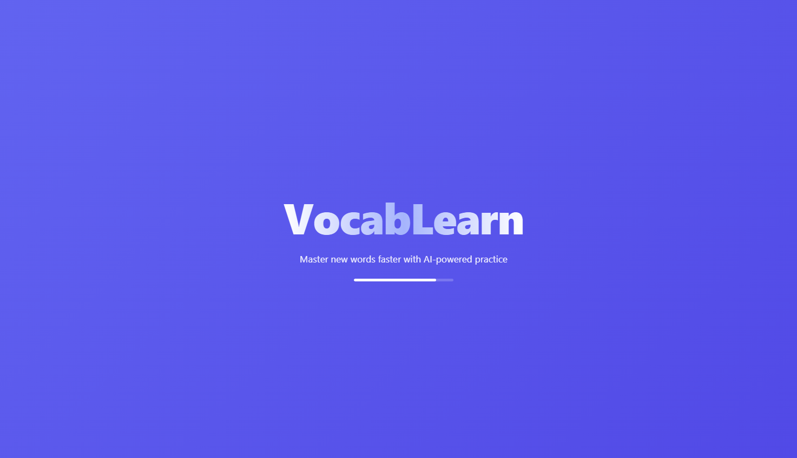

### 2. Sign Up Page
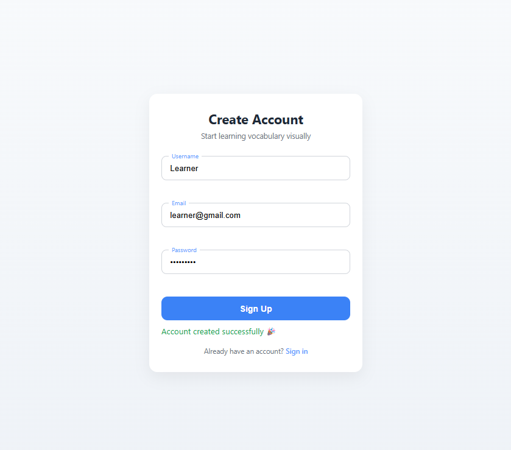

### 3. Sign In Page
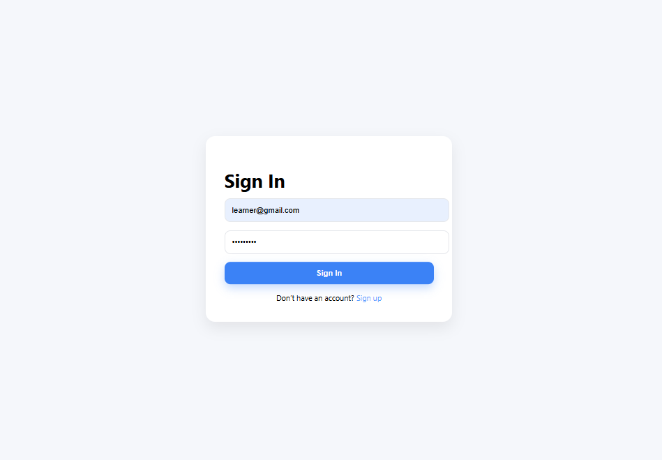

### 4. Language Selection
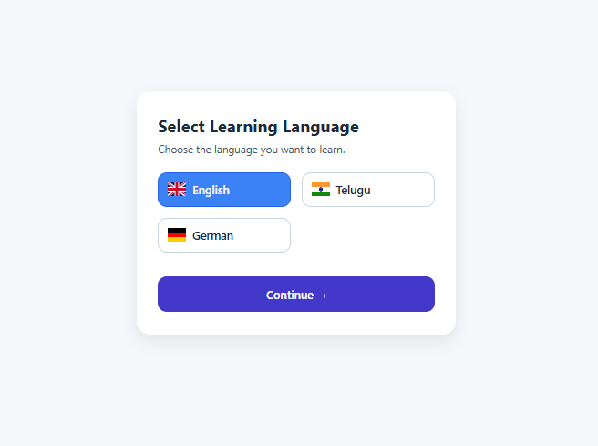

### 5. Level Selection
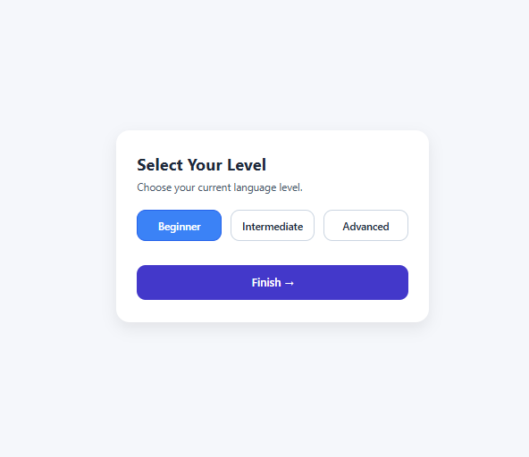

### 6. Dashboard
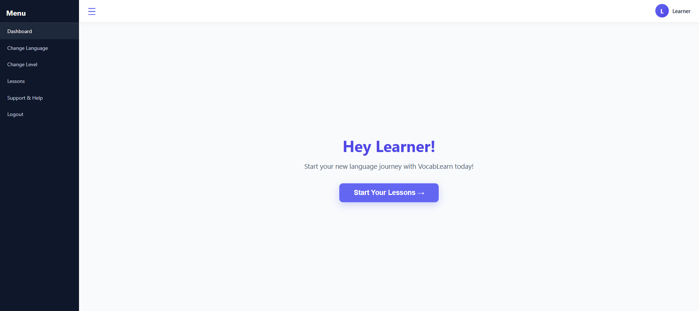

### 7. Lessons Overview
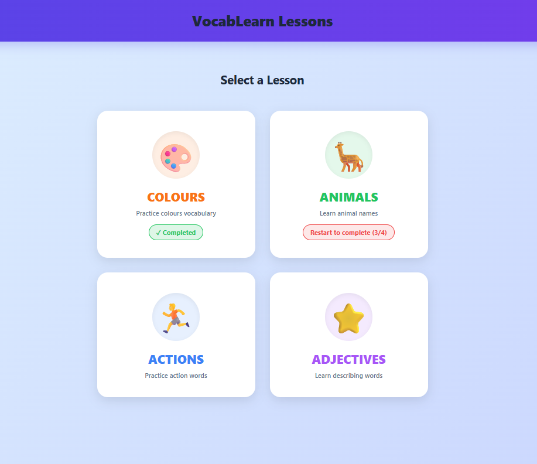

### 8. Lesson Page - 1
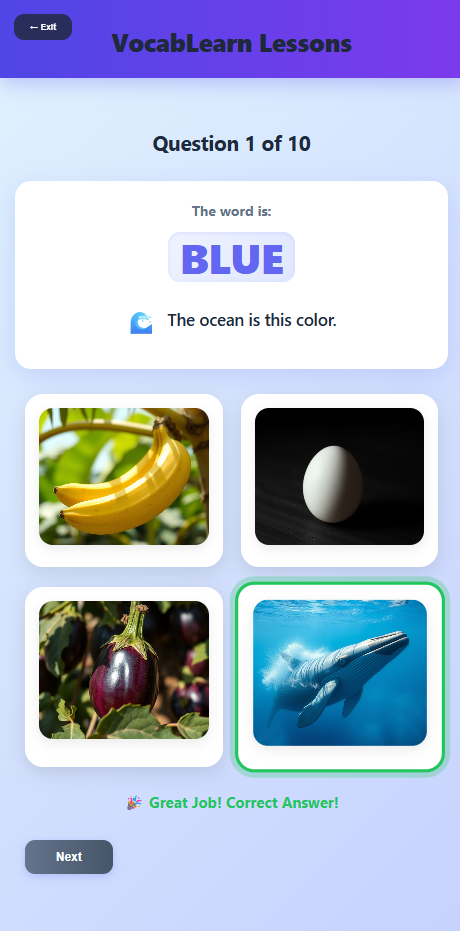

### 9. Lesson Page - 2
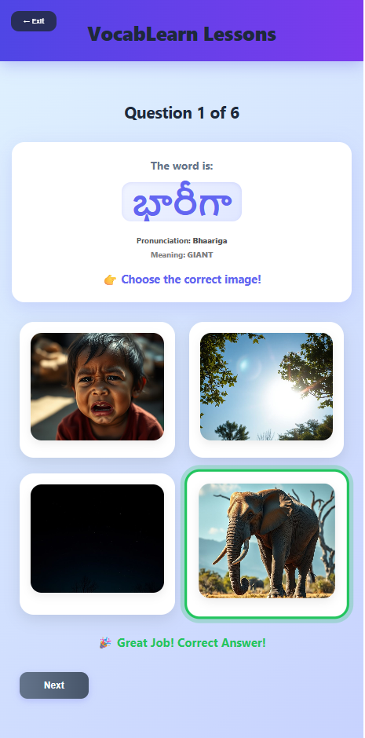

### 10. Lesson Page - 3
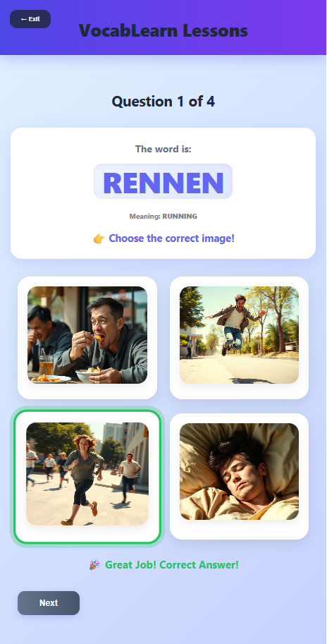

### 11. Progress Page
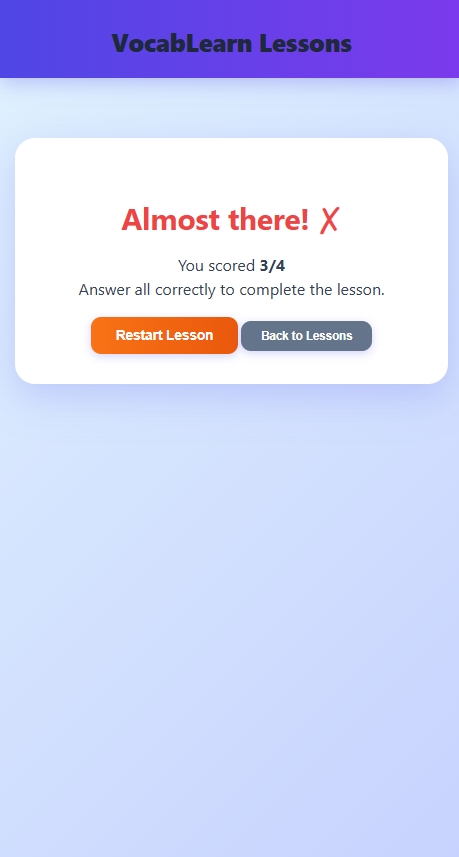

### 12. Progress Page (Detailed)
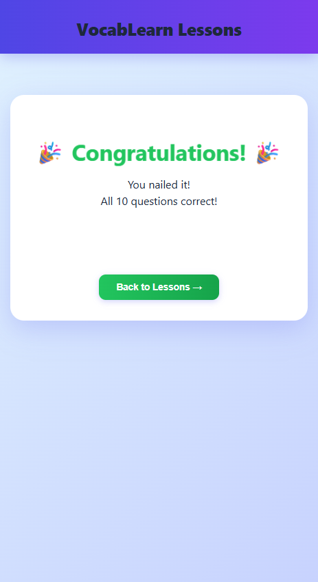

### 13. Help & Support
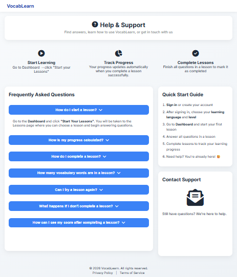

---

## 🤝 Contributing

Contributions are welcome! Feel free to fork the repo and submit a pull request.

---

## 📌 Future Improvements

* Add more languages
* Improve UI/UX
* Add user progress tracking using database
* Deploy to cloud

---

## 📄 License

This project is for educational purposes.
